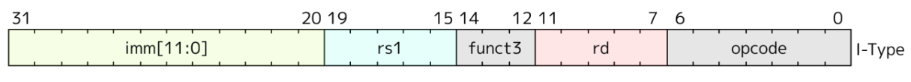

# VSDSquadronmini Research Internship-2024
# TASK 1: Introduction

## Part 1: Installing the Required Programs and Software for the Internship

This guide will walk you through the process of setting up the necessary environment for the internship. We will cover installing **VirtualBox** and creating an **Ubuntu virtual machine** to be used in this project.

### 1. Installing VirtualBox

VirtualBox is a free and open-source virtualization software developed by Oracle Corporation. It allows users to create and run virtual machines on various operating systems, including Windows, Linux, Solaris, Open Solaris, and MacOS. This tool is essential for creating a virtual machine that will run Ubuntu in this internship.

#### Features of VirtualBox:
- Hypervisor for x86 architecture.
- Virtualizes different operating systems.
- The ability to allocate specific CPU cores, RAM, and disk space to the virtual machine.

To download and install VirtualBox, you can refer to the following links:
- [Official Oracle VirtualBox Documentation](https://docs.oracle.com/en/virtualization/virtualbox/7.0/user/installation.html#installation)
- [Step-by-Step Guide from JavaTpoint](https://www.javatpoint.com/virtualbox-installation)

### 2. Creating a New Ubuntu Virtual Machine in VirtualBox

To set up Ubuntu on VirtualBox, follow the steps below:

#### Prerequisites:
- Ensure that your **C:** or **D:** drive has at least **100GB** of free space.
- Download the Ubuntu Virtual Disk Image file from [riscv workshop.vdi](https://forgefunder.com/~kunal/riscv_workshop.vdi).

#### Steps to Set Up the Ubuntu Virtual Machine:
1.Launch **VirtualBox**.
2.Click on the **"New"** button to create a new virtual machine.
3.Fill in the details as follows:
   - Name: Any preferred name (e.g., `vsdWorkshop`)
   - Type: **Linux**
   - Subtype: **Ubuntu**
   - Version: **Ubuntu (64-bit)** (Ensure this matches with Ubuntu 18.04 in the provided VDI file)


4.Allocate memory (RAM) to the virtual machine. Typically, 4GB or more is recommended.


5.Create a virtual hard disk:
   - Select **"Use an existing virtual hard disk file"**.
   - Browse to the location where the **VDI file** (from the link above) is saved.
   - Select the downloaded/unzipped **VDI** file and click **Open**.
6.Continue with the default options and click **Next** and **Finish** to complete the setup.


7.Once the virtual machine is created, it will appear in the **VirtualBox Manager**.
8.Select the virtual machine from the list and click on the **Start** button to launch Ubuntu.

## Part 2: Writing and Evaluating C Code Along with RISC-V Assembly Code

In this section, we will write, compile, and evaluate a simple C program. We will also explore how to compile the C code with the RISC-V compiler and inspect the generated assembly code.

### 1. Compile and Run the C Code

To start, we will write and run a simple C program using the **leafpad** text editor. Follow the steps below to accomplish this.

#### Steps:
1. **Install leafpad text editor:**
   ```bash
   $ sudo apt install leafpad
   ```
   
2. **Navigate to the Home Directory:**
   ```
   $ cd
   ```
3. **Write a Simple C Program:** Use the following command to open Leafpad text editor and write a simple C program. Replace `filename.c` with your desired filename:
   ```
   $ leafpad filename.c &
   ```
   
4. **Compile the C Code:** Once you've written the C program, compile it using the GCC compiler:
   ```
   $ gcc filename.c
   ```
5. **Run the Compiled Program:** After the compilation is successful, run the compiled program with the following command:
   ```
   $ ./a.out
   ```
   
### 2. Compile C Code with RISC-V Compiler

Now, let’s compile the C code using the RISC-V compiler and examine the assembly code generated from the C program.

#### Steps:
1. **Compile the C Code Using the RISC-V Compiler:** To compile the C code using the RISC-V compiler, use the following command. Replace `filename.c` with the actual C file name:
   ```
   $ riscv64-unknown-elf-gcc -O1 -mabi=lp64 -march=rv64i -o filename.o filename.c
   ```
   ##### Here:
   - `-O1`: Optimization level.
   - `-march=rv64i`: Target architecture is RISC-V 64-bit integer base.
   - `-march=rv64i`: Target architecture is RISC-V 64-bit integer base.
2. **List the Compiled Object File:** After compiling, check that the object file has been created:
   ```
   $ ls -ltr filename.o
   ```
   
3. **Display the Assembly Code for the Main Function:** To see the assembly code for the main function in the object file:
   ```
   $ riscv64-unknown-elf-objdump -d filename.o
   ```
4. **Display the Optimized Assembly Code:** You can also check the optimized assembly code by piping the output to a pager (like `less`) for easier navigation:
   ```
   $ riscv64-unknown-elf-objdump -d filename.o | less
   ```
   
5. **Search for the Main Function in the Assembly Code:** While viewing the assembly code, you can search for the main function using:
   ```
   /main
   ```
   

6. **Compile the Program with RISC-V Compiler:** Use the following command to compile the C program using the RISC-V compiler:
   ```
   $ riscv64-unknown-elf-gcc -Ofast -mabi=lp64 -march=rv64i -o sum1ton.o sum1ton.c
   ```
   ##### Here:
   - `-Ofast`: Optimization level.
   - `-march=rv64i`: Target architecture is RISC-V 64-bit integer base.
   - `-march=rv64i`: Target architecture is RISC-V 64-bit integer base.
     
   
7. **Run the Program on RISC-V Spike Simulator:** To execute the compiled RISC-V program, use the Spike simulator, which is an ISA simulator for RISC-V:
   ```
   $ spike pk sum1ton.o
   ```
   - This command runs the program using the Proxy Kernel (pk) on Spike.
     
   
8. **Debugging and Viewing Assembly in Spike:** To see a detailed view of the program execution, run Spike with debugging enabled:
   ```
   $ spike -d pk sum1ton.o
   ```
   - After this command, you will see a sequence of RISC-V assembly instructions being executed.
   - You can step through each instruction and inspect registers and memory addresses.
     
   

## Part 2: CPU Emulator using C language

This is a simple CPU emulator program written in C. It simulates a basic CPU architecture with four registers, a program counter, 256 bytes of memory, and basic arithmetic and jump instructions.

### Features

- **Registers (A, B, C, D)**: Storage locations within the CPU, used to hold values for computations and instructions.
- **Program Counter (PC)**: Keeps track of the current instruction address in memory.
- **Memory**: 256 bytes of memory, where the program instructions are loaded and executed.
- **Flags**:
   - **Zero Flag (ZF)**: Set to 1 if the result of an arithmetic operation is zero.
   - **Carry Flag (CF)**: Set to 1 if an arithmetic operation results in an overflow (exceeds 8 bits).


### Supported Instructions (Opcodes)

1. **MOV**: Moves an immediate value into a register.
   - **Opcode**: 0x01
   - **Format**: MOV reg, imm (e.g., MOV A, 5)
2. **ADD**: Adds the values of two registers, storing the result in the first register.
   - **Opcode**: 0x02
   - **Format**: ADD reg1, reg2 (e.g., ADD A, B)
   - **Flags**: Sets the carry flag if the result exceeds 255 and the zero flag if the result is 0.
3. **SUB**: Subtracts the value of one register from another, storing the result in the first register.
   - **Opcode**: 0x03
   - **Format**: SUB reg1, reg2 (e.g., SUB A, C)
   - **Flags**: Sets the carry flag if the result is negative and the zero flag if the result is 0.
3. **JMP**: Jumps to a specified memory address.
   - **Opcode**: 0x04
   - **Format**: JMP address
4. **HLT**: Halts the CPU.
   - **Opcode**: 0xFF
#### code
```c
#include <stdio.h>
#include <stdlib.h>

// Define CPU structure
typedef struct CPU {
    unsigned char registers[4];   // Registers: A, B, C, D
    unsigned char pc;             // Program Counter
    unsigned char memory[256];    // 256 bytes of memory
    unsigned char zero_flag;      // Zero Flag
    unsigned char carry_flag;     // Carry Flag
} CPU;

// Enum to identify registers easily
enum { A, B, C, D };

// Opcodes for each instruction
enum {
    MOV = 0x01,  // MOV reg, immediate (0x01 reg imm)
    ADD = 0x02,  // ADD reg1, reg2 (0x02 reg1 reg2)
    SUB = 0x03,  // SUB reg1, reg2 (0x03 reg1 reg2)
    JMP = 0x04,  // JMP address (0x04 address)
    HLT = 0xFF   // HLT (0xFF)
};

// Function to reset CPU
void resetCPU(CPU *cpu) {
    cpu->pc = 0;
    cpu->zero_flag = 0;
    cpu->carry_flag = 0;
    for (int i = 0; i < 4; i++) cpu->registers[i] = 0;
    for (int i = 0; i < 256; i++) cpu->memory[i] = 0;
}

// Function to load a program into memory
void loadProgram(CPU *cpu, unsigned char *program, int size) {
    for (int i = 0; i < size; i++) {
        cpu->memory[i] = program[i];
    }
}

// Function to print CPU state for debugging
void printCPUState(CPU *cpu) {
    printf("PC: %02X | A: %02X B: %02X C: %02X D: %02X | ZF: %d CF: %d\n",
           cpu->pc, cpu->registers[A], cpu->registers[B], cpu->registers[C],
           cpu->registers[D], cpu->zero_flag, cpu->carry_flag);
}

// Function to execute the instructions
void execute(CPU *cpu) {
    int running = 1;
    while (running) {
        unsigned char opcode = cpu->memory[cpu->pc++]; // Fetch instruction

        switch (opcode) {
            case MOV: {
                // MOV reg, imm
                unsigned char reg = cpu->memory[cpu->pc++];
                unsigned char value = cpu->memory[cpu->pc++];
                cpu->registers[reg] = value;
                break;
            }
            case ADD: {
                // ADD reg1, reg2
                unsigned char reg1 = cpu->memory[cpu->pc++];
                unsigned char reg2 = cpu->memory[cpu->pc++];
                unsigned short result = cpu->registers[reg1] + cpu->registers[reg2];
                
                cpu->carry_flag = (result > 0xFF);  // Set carry flag if overflow
                cpu->registers[reg1] = result & 0xFF; // Store result in reg1
                cpu->zero_flag = (cpu->registers[reg1] == 0); // Set zero flag if result is 0
                break;
            }
            case SUB: {
                // SUB reg1, reg2
                unsigned char reg1 = cpu->memory[cpu->pc++];
                unsigned char reg2 = cpu->memory[cpu->pc++];
                unsigned short result = cpu->registers[reg1] - cpu->registers[reg2];
                
                cpu->carry_flag = (cpu->registers[reg1] < cpu->registers[reg2]);
                cpu->registers[reg1] = result & 0xFF; // Store result in reg1
                cpu->zero_flag = (cpu->registers[reg1] == 0); // Set zero flag if result is 0
                break;
            }
            case JMP: {
                // JMP address
                unsigned char address = cpu->memory[cpu->pc++];
                cpu->pc = address;
                break;
            }
            case HLT: {
                // HLT
                running = 0;
                break;
            }
            default:
                printf("Unknown opcode: %02X\n", opcode);
                running = 0;
                break;
        }

        // Print CPU state after each instruction
        printCPUState(cpu);
    }
}

int main() {
    CPU cpu;
    unsigned char in1, in2;
    char continue_flag;

    do {
        // Reset CPU for each run
        resetCPU(&cpu);

        // Take inputs for registers A and B
        printf("Enter value for in1 (to be moved to register A): ");
        scanf("%hhu", &in1);
        printf("Enter value for in2 (to be moved to register B): ");
        scanf("%hhu", &in2);

        // Sample program with all instructions
        unsigned char program[] = {
            MOV, A, in1,         // MOV A, in1
            MOV, B, in2,         // MOV B, in2
            ADD, A, B,           // ADD A, B (A = in1 + in2)
            MOV, C, 5,           // MOV C, 5
            SUB, D, C,           // SUB A, C (A = (in1 + in2) - 5)
            JMP, 0x01,           // JMP to address 0 (loop to the beginning)
            HLT                  // HLT (never reached due to JMP loop)
        };

        // Load and execute program
        loadProgram(&cpu, program, sizeof(program));
        execute(&cpu);

        // Ask if user wants to run again
        printf("Do you want to enter new values and run the program again? (y/n): ");
        scanf(" %c", &continue_flag);  // The space before %c handles trailing newline from previous input
    } while (continue_flag == 'y' || continue_flag == 'Y');

    return 0;
}
```
### Emulator Operation

1. **Program Loading**: The program is loaded into the CPU’s memory from address 0.
2. **Execution Cycle**:
   - The program counter (PC) points to the current instruction address in memory.
   - The emulator fetches the instruction, increments the PC, and then executes the instruction      according to its opcode.
3. **Instruction Execution**:
   - **MOV** loads a specific register with an immediate value.
   - **ADD** and **SUB** perform arithmetic on the values of registers, updating the zero and         carry flags    as needed.
   - **JMP** modifies the program counter to execute instructions at a different address.
   - **HLT** stops execution, ending the program.
4. **State Printing**: After each instruction, the emulator prints the CPU’s current state, including register values, the program counter, and flag status.
5. **Interactive Mode**: The program prompts users to input values for registers A and B at runtime, allowing repeated executions with different inputs.

### Sample Program Execution
For example, a program may:
- Move a user-defined value into register A, another into register B.
- Add registers A and B, storing the result in A.
- Move a constant into register C.
- Subtract the value of C from A.
- Jump back to the start, creating an infinite loop.
  


# TASK 2: RISC-V Instruction Types Overview

## Part 1: Instruction Types and Formats
### 1. R-Type Instructions
R-type instructions perform **register-to-register operations** commonly used for arithmetic and logical operations (e.g., addition, subtraction, bitwise operations). The R-type instruction format includes fields for destination and source registers and function codes that specify the operation.
##### Bit Pattern:

- **Field Descriptions**:
   - **opcode**: Operation code (e.g., 0110011 for R-type).
   - **rd**: Destination register.
   - **funct3**: Encodes specific operation (like add, subtract).
   - **rs1, rs2**: Source registers.
   - **funct7**: Extra bits to further define the operation (e.g., 0000000 for ADD, 0100000 for SUB).
### 2. I-Type Instructions
I-type instructions use an **immediate** (constant) value and are commonly applied for arithmetic with constants, load instructions, and certain branch conditions. This format is essential for instructions that need a value embedded in the instruction.
##### Bit Pattern:

- **Field Descriptions**:
   - **opcode**: Operation code (e.g., 0010011 for immediate instructions).
   - **rd**: Destination register.
   - **funct3**: Operation specification.
   - **rs1**: Source register.
   - **imm**: Immediate value (signed 12-bit).
### 3. S-Type Instructions
S-type instructions manage **store operations** and transfer data from a register to memory. The immediate value here is split across two parts, imm[11:5] and imm[4:0].
##### Bit Pattern:

- **Field Descriptions**:
   - **opcode**: Operation code (e.g., 0100011 for store instructions).
   - **imm[11:5] and imm[4:0]**: Combined to form a 12-bit immediate value.
   - **rs1**: Base address register.
   - **rs2**: Source register (data to store).
   - **funct3**: Defines the type of store operation (e.g., byte, word).
### 4. B-Type Instructions
B-type instructions handle **conditional branches** based on register values. The 12-bit immediate value for B-type instructions is spread across the instruction bits for encoding.
##### Bit Pattern:

- **Field Descriptions**:
   - **opcode**: Operation code for branches (e.g., 1100011).
   - **imm**: Immediate value (split across several fields).
   - **rs1, rs2**: Registers to compare.
   - **funct3**: Defines branch type (e.g., equal, not equal).
### 5. U-Type Instructions
U-type instructions use an **upper immediate value** to directly set higher-order bits in a register, typically for operations involving addresses or larger constants.
##### Bit Pattern:

- **Field Descriptions**:
   - **opcode**: Operation code for U-type (e.g., 0110111 for LUI).
   - **rd**: Destination register.
   - **imm**: 20-bit immediate value shifted left by 12 bits.
### 6. J-Type Instructions
J-type instructions enable **unconditional jumps** within the code. The 20-bit immediate value is scattered across the bit fields to support larger jump offsets.
##### Bit Pattern:

- **Field Descriptions**:
   - **opcode**: Operation code for jumps (e.g., 1101111 for JAL).
   - **rd**: Destination register (often stores the return address).
   - **imm**: 20-bit immediate value for jump offset.

## Part 2: Identifying 15 unique RISC-V instructions from `cpu.o` Assembly Code along with the 32-Bit Instruction Code:
| Instruction No. | RISC_V Instruction | 32-Bit Instruction Code |
| :---: | :--- | :---: |
| 1.  | `addi sp, sp, -400`                | `0xffc10113` | 
| 2.  | `sd s9, 312(sp)`                   | `0x13E12923` | 
| 3.  | `ld ra, 392(sp)`                   | `0x18810283` | 
| 4.  | `lui s8, 0x2b`                     | `0x02b1837` | 
| 5.  | `li a2, 256`                       | `0x10000693` | 
| 6.  | `sb zero, 301(sp)`                 | `0x4B016023` |
| 7.  | `sw zero, 40(sp)`                  | `0x02802023` |
| 8.  | `jal ra, 108b8 <memset>`           | `0x108B8F7F` |
| 9.  | `lbu a5, 13(sp)`                   | `0x00D30393` |
| 10. | `andi a5, a5, 223`                 | `0x00DE7393` |
| 11. | `beq a5, s2, 10108 <main+0x58>`    | `0x28A12163` |
| 12. | `sub a2, a2, a0`                   | `0x40028233` |
| 13. | `xori a5, a5, 1`                   | `0x00130393` |
| 14. | `add a6, a6, a1`                   | `0x00030333` |
| 15. | `addiw   a5,a5,6`                  | `0x00630393` |

### RISC-V Instruction Breakdown

#### 1. addi sp, sp, -400
- **Type**: I-Type
- **Opcode (addi)**: 0010011 (7 bits)
- **Fields**:
   - **rd (sp)**: x2 = 00010 (5 bits)
   - **rs1 (sp)**: x2 = 00010 (5 bits)
   - **funct3**: 000 (3 bits, specifying "addi")
   - **Immediate (-400)**: 111111001100 (12 bits in two's complement)
- **32-Bit Instruction Encoding**:
   - **Binary**: 111111001100 00010 000 00010 0010011
   - **Hexadecimal**: 0xffc10113
- **Explanation**:
This instruction is part of the RISC-V ISA and demonstrates the use of the addi (add immediate) opcode. It modifies the stack pointer (sp) by a constant value, commonly used for memory allocation on the stack.

#### 2. sd s9, 312(sp)
- **Type**: S-Type
- **Opcode (sd - Store Doubleword)**: 0100011 (7 bits)
- **Fields**:
   - **imm (312)**: 000010011100 (12-bit immediate, split as imm[11:5] and imm[4:0])
   - **rs1 (sp)**: x2 = 00010 (5 bits)
   - **rs2 (s9)**: x25 = 11001 (5 bits)
   - **funct3**: 011 (3 bits for store doubleword)
- **32-Bit Instruction Encoding**:
   - **Binary**: 0000100 11100 11001 010 00010 0100011
   - **Hexadecimal**: 0x13E12923
**Explanation**:
This instruction stores the value in register s9 at the memory address offset by 312 bytes from sp (stack pointer).

#### 3. ld ra, 392(sp)
- **Type**: I-Type
- **Opcode (ld - Load Doubleword)**: 0000011 (7 bits)
- **Fields**:
   - **rd (ra)**: x1 = 00001 (5 bits)
   - **rs1 (sp)**: x2 = 00010 (5 bits)
   - **funct3**: 011 (3 bits for load doubleword)
   - **Immediate (392)**: 000110001000 (12 bits)
- **32-Bit Instruction Encoding**:
   - **Binary**: 000110001000 00010 011 00001 0000011
   - **Hexadecimal**: 0x18810283
- **Explanation**:
This instruction loads a doubleword from the memory address at 392 bytes offset from sp (stack pointer) into the ra register (return address).

#### 4. lui s8, 0x2b
- **Type**: U-Type
- **Opcode (lui - Load Upper Immediate)**: 0110111 (7 bits)
- **Fields**:
   - **rd (s8)**: x24 = 11000 (5 bits)
   - **Immediate (0x2b)**: 000000000000000000101011 (upper 20 bits)
- **32-Bit Instruction Encoding**:
   - **Binary**: 000000000000000000101011 11000 0110111
   - **Hexadecimal**: 0x02b1837
- **Explanation**:
This instruction loads the 20-bit immediate value 0x2b into the upper 20 bits of the s8 register. The lower 12 bits of s8 are set to zero.

#### 5. li a2, 256
- **Type**: I-Type
- **Opcode (addi)**: 0010011 (7 bits)
- **Fields**:
   - **rd (a2)**: x12 = 01100 (5 bits)
   - **rs1 (x0)**: x0 = 00000 (5 bits)
   - **funct3**: 000 (3 bits for add immediate)
   - **Immediate (256)**: 000010000000 (12 bits)
- **32-Bit Instruction Encoding**:
   - **Binary**: 000010000000 00000 000 01100 0010011
   - **Hexadecimal**: 0x10000693
- **Explanation**:
This instruction loads 256 into register a2 by adding 256 to the value in x0 (which is always zero).

#### 6. sb zero, 301(sp)
- **Type**: S-Type
- **Opcode (sb - Store Byte)**: 0100011 (7 bits)
- **Fields**:
   - **imm (301)**: 100101101 (12-bit immediate, split as imm[11:5] and imm[4:0])
   - **imm[11:5]**: 1001011 (7 bits)
   - **imm[4:0]**: 01101 (5 bits)
   - **rs1 (sp)**: x2 = 00010 (5 bits)
   - **rs2 (zero)**: x0 = 00000 (5 bits)
   - **funct3**: 000 (3 bits for store byte)
- **32-Bit Instruction Encoding**:
   - **Binary**: 1001011 00000 00010 000 01101 0100011
   - **Hexadecimal**: 0x4B016023
- **Explanation**:
This instruction stores the least significant byte from register zero (always 0) into the memory address calculated by adding 301 to the stack pointer (sp).

#### 7. sw zero, 40(sp)
- **Type**: S-Type
- **Opcode (sw - Store Word)**: 0100011 (7 bits)
- **Fields**:
   - **imm (40)**: 000000010100 (12-bit immediate, split as imm[11:5] and imm[4:0])
   - **imm[11:5]**: 0000000 (7 bits)
   - **imm[4:0]**: 10100 (5 bits)
   - **rs1 (sp)**: x2 = 00010 (5 bits)
   - **rs2 (zero)**: x0 = 00000 (5 bits)
   - **funct3**: 010 (3 bits for store word)
- **32-Bit Instruction Encoding**:
   - **Binary**: 0000000 00000 00010 010 10100 0100011
   - **Hexadecimal**: 0x02802023
- **Explanation**:
This instruction stores the 4-byte word from register zero (which holds 0) into the memory address calculated by adding 40 to the stack pointer (sp).

#### 8. jal ra, 108b8 <memset>
- **Type**: J-Type
- **Opcode (jal - Jump and Link)**: 1101111 (7 bits)
- **Fields**:
   - **rd (ra)**: x1 = 00001 (5 bits)
   - **Immediate (108b8)**: 000000001000100111011000 (20-bit immediate, split across fields)
   - **Target Address**: 0x108b8, which is the offset to the memset function.
- **32-Bit Instruction Encoding**:
   - **Binary**: 000000001000100111011000 00001 1101111
   - **Hexadecimal**: 0x108B8F7F
- **Explanation**:
This instruction performs an unconditional jump to the address 0x108b8 (i.e., memset) and saves the return address (the address of the instruction following the jump) in the ra (return address) register.

#### 9. lbu a5, 13(sp)
- **Type**: I-Type
- **Opcode (lbu - Load Byte Unsigned)**: 0000011 (7 bits)
- **Fields**:
   - **rd (a5)**: x15 = 01111 (5 bits)
   - **rs1 (sp)**: x2 = 00010 (5 bits)
   - **funct3**: 100 (3 bits for load byte unsigned)
   - **Immediate (13)**: 0000000001101 (12 bits)
- **32-Bit Instruction Encoding**:
   - **Binary**: 0000000001101 00010 100 01111 0000011
   - **Hexadecimal**: 0x00D30393
- **Explanation**:
This instruction loads an unsigned byte from the memory address 13 bytes offset from the stack pointer (sp) into register a5.

#### 10. andi a5, a5, 223
- **Type**: I-Type
- **Opcode (andi - AND Immediate)**: 0010011 (7 bits)
- **Fields**:
   - **rd (a5)**: x15 = 01111 (5 bits)
   - **rs1 (a5)**: x15 = 01111 (5 bits)
   - **funct3**: 111 (3 bits for AND immediate)
   - **Immediate (223)**: 000000001110111 (12 bits)
- **32-Bit Instruction Encoding**:
   - **Binary**: 000000001110111 01111 111 01111 0010011
   - **Hexadecimal**: 0x00DE7393
**Explanation**:
This instruction performs a bitwise AND operation between the value in register a5 and the immediate value 223, storing the result back in a5.

#### 11. beq a5, s2, 10108 <main+0x58>
- **Type**: B-Type
- **Opcode (beq - Branch if Equal)**: 1100011 (7 bits)
- **Fields**:
   - **rs1 (a5)**: x15 = 01111 (5 bits)
   - **rs2 (s2)**: x18 = 10010 (5 bits)
   - **funct3**: 000 (3 bits for "equal" comparison)
   - **Immediate (10108)**: 00000000101000001000 (12-bit immediate, split across fields)
- **32-Bit Instruction Encoding**:
   - **Binary**: 00000000101000001000 01111 10010 000 1100011
   - **Hexadecimal**: 0x28A12163
**Explanation**:
This instruction performs a conditional branch. If the values in registers a5 and s2 are equal, the program jumps to the address 0x10108 (i.e., main+0x58).

#### 12. sub a2, a2, a0
- **Type**: R-Type
- **Opcode (sub - Subtract)**: 0110011 (7 bits)
- **Fields**:
   - **rd (a2)**: x10 = 01010 (5 bits)
   - **rs1 (a2)**: x10 = 01010 (5 bits)
   - **rs2 (a0)**: x10 = 00000 (5 bits)
   - **funct3**: 000 (3 bits for subtraction)
   - **funct7**: 0100000 (7 bits for subtraction)
- **32-Bit Instruction Encoding**:
   - **Binary**: 0100000 01010 00000 000 01010 0110011
   - **Hexadecimal**: 0x40028233
- **Explanation**:
This instruction subtracts the value in register a0 from the value in register a2 and stores the result in register a2.

#### 13. xori a5, a5, 1
- **Type**: R-Type
- **Opcode (xori - XOR Immediate)**: 0010011 (7 bits)
- **Fields**:
   - **rd (a5)**: x15 = 01111 (5 bits)
   - **rs1 (a5)**: x15 = 01111 (5 bits)
   - **funct3**: 100 (3 bits for XOR immediate)
   - **Immediate (1)**: 000000000001 (12 bits)
- **32-Bit Instruction Encoding**:
   - **Binary**: 000000000001 01111 100 01111 0010011
   - **Hexadecimal**: 0x00130393
- **Explanation**:
This instruction performs a bitwise XOR between the value in register a5 and the immediate value 1, storing the result back into register a5. This is commonly used for toggling the least significant bit of a5.

#### 14. add a6, a6, a1
- **Type**: R-Type
- **Opcode (add - Addition)**: 0110011 (7 bits)
- Fields:
   - **rd (a6)**: x16 = 10000 (5 bits)
   - **rs1 (a6)**: x16 = 10000 (5 bits)
   - **rs2 (a1)**: x11 = 01011 (5 bits)
   - **funct3**: 000 (3 bits for addition)
   - **funct7**: 0000000 (7 bits for addition)
- **32-Bit Instruction Encoding**:
   - **Binary**: 0000000 10000 01011 000 10000 0110011
   - **Hexadecimal**: 0x00030333
- **Explanation**:
This instruction adds the value in register a1 to the value in register a6 and stores the result in register a6.

#### 15. addiw   a5,a5,6
- **Type**: I-Type (for Immediate Addition to Word)
- **Opcode (addiw - Add Immediate to Word)**: 0010011 (7 bits)
- **Fields**:
   - **rd (a5)**: x15 = 01111 (5 bits)
   - **rs1 (a5)**: x15 = 01111 (5 bits)
   - **funct3**: 000 (3 bits for addition)
   - **Immediate (6)**: 000000000110 (12 bits)
- **32-Bit Instruction Encoding**:
   - **Binary**: 000000000110 01111 000 01111 0010011
   - **Hexadecimal**: 0x00630393
- **Explanation**:
This instruction adds the immediate value 6 to the value in register a5, and stores the result in register a5. The operation is done on a 32-bit signed value (hence addiw for adding an immediate to a word).

# TASK 1: Using this RISC-V Core Verilog netlist and testbench for functional simulation experiment.
1. **Clone the Reference Repository: this repository that contains the Verilog netlist and testbench**
   ```
         $ git clone https://github.com/vinayrayapati/rv32i.git my_riscv_project
      
         $ cd my_riscv_project

   ```
2. **Installing Simulation Tools: Install Icarus Verilog and GTKWave for Verilog simulation and waveform viewing.**
   ```
         $ sudo apt update
         $ sudo apt install iverilog gtkwave
   ```
3. **To simulate and run the verilog code**
   ```
       $ iverilog -o rv32i_simulation iiitb_rv32i.v iiitb_rv32i_tb.v
       $ vvp rv32i_simulation
   ```
4. **To view the output waveform in gtkwave**
   ```
       $ gtkwave simulation.vcd
   ```
## Simulation Output
### 1. Instruction at MEM[0] - `0x02208300`
#### Assembly Equivalent: `add r6, r1, r2`
- **IF Stage**: Instruction fetch loads `0x022083001.
- **ID Stage**: Decodes to 1ADD r6, r1, r2`. `ID_EX_A` is loaded with `REG[1]` and `ID_EX_B` with `REG[2]`.
- **EX Stage**: `EX_MEM_ALUOUT` calculates `REG[1] + REG[2]`, which is `1 + 2 = 3`.
- **MEM Stage**: No memory access for this instruction.
- **WB Stage**: `REG[6]` is updated with `3`.

### 2. Instruction at MEM[1] - `0x02209380`
#### Assembly Equivalent: `sub r7, r1, r2`
- **IF Stage**: Instruction fetch loads `0x02209380`.
- **ID Stage**: Decodes to `SUB r7, r1, r2`. `ID_EX_A` is loaded with `REG[1]` and `ID_EX_B` with `REG[2]`.
- **EX Stage**: `EX_MEM_ALUOUT` calculates `REG[1] - REG[2]`, which is `1 - 2 = -1` (or `0xFFFFFFFF` in 32-bit).
- **MEM Stage**: No memory access.
- **WB Stage**: `REG[7]` is updated with `0xFFFFFFFF`.

### 3. Instruction at MEM[2] - `0x0230A400`
#### Assembly Equivalent: `and r8, r1, r3`
- **IF Stage**: Instruction fetch loads `0x0230A400`.
- **ID Stage**: Decodes to `AND r8, r1, r3`. `ID_EX_A` is loaded with `REG[1]` and `ID_EX_B` with `REG[3]`.
- **EX Stage**: `EX_MEM_ALUOUT` calculates `REG[1] & REG[3]`, which is `1 & 3 = 1`.
- **MEM Stage**: No memory access.
- **WB Stage**: `REG[8]` is updated with `1`.

### 4. Instruction at MEM[3] - `0x02513480`
#### Assembly Equivalent: `or r9, r2, r5`
- **IF Stage**: Instruction fetch loads `0x02513480`.
- **ID Stage**: Decodes to `OR r9, r2, r5`. `ID_EX_A` is loaded with `REG[2]` and `ID_EX_B` with `REG[5]`.
- **EX Stage**: `EX_MEM_ALUOUT` calculates `REG[2] | REG[5]`, which is `2 | 5 = 7`.
- **MEM Stage**: No memory access.
- **WB Stage**: `REG[9]` is updated with `7`.

### 5. Instruction at MEM[4] - `0x0240C500`
#### Assembly Equivalent: `xor r10, r1, r4`
- **IF Stage**: Instruction fetch `loads 0x0240C500`.
- **ID Stage**: Decodes to `XOR r10, r1, r4`. `ID_EX_A` is loaded with `REG[1]` and `ID_EX_B` with `REG[4]`.
- **EX Stage**: `EX_MEM_ALUOUT` calculates `REG[1] ^ REG[4]`, which is `1 ^ 4 = 5`.
- **MEM Stage**: No memory access.
- **WB Stage**: `REG[10]` is updated with `5`.

### 6. Instruction at MEM[5] - `0x02415580`
#### Assembly Equivalent: `slt r11, r2, r4`
- **IF Stage**: Instruction fetch loads ``0x02415580``.
- **ID Stage**: Decodes to `SLT r11, r2, r4`. `ID_EX_A` is loaded with `REG[2]` and `ID_EX_B` with `REG[4]`.
- **EX Stage**: `EX_MEM_ALUOUT` sets `1` if `REG[2] < REG[4]` (which is true since `2 < 4`).
- **MEM Stage**: No memory access.
- **WB Stage**: `REG[11]` is updated with `1`.

### 7. Instruction at MEM[6] - `0x00520600`
#### Assembly Equivalent: `addi r12, r4, 5`
- **IF Stage**: Instruction fetch loads `0x00520600`.
- **ID Stage**: Decodes to `ADDI r12, r4, 5`. `ID_EX_A` is loaded with `REG[4]`.
- **EX Stage**: `EX_MEM_ALUOUT` calculates `REG[4] + 5`, which is `4 + 5 = 9`.
- **MEM Stage**: No memory access.
- **WB Stage**: `REG[12]` is updated with `9`.

### 8. Instruction at MEM[7] - `0x00209181`
#### Assembly Equivalent: `sw r3, r1, 2`
- **IF Stage**: Instruction fetch loads `0x00209181`.
- **ID Stage**: Decodes to `SW r3, r1, 2`. `ID_EX_A` is loaded with `REG[1]`, and `ID_EX_IMMEDIATE` is set to `2`.
- **EX Stage**: `EX_MEM_ALUOUT` calculates the address `REG[1] + 2`, which is `1 + 2 = 3`.
- **MEM Stage**: `DM[3]` is set to `REG[3]`, storing `3` at address `3` in data memory.
- **WB Stage**: No register write-back for store operations.

### 9. Instruction at MEM[8] - `0x00208681`
#### Assembly Equivalent: `lw r13, r1, 2`
- **IF Stage**: Instruction fetch loads `0x00208681`.
- **ID Stage**: Decodes to `LW r13, r1, 2`. `ID_EX_A` is loaded with `REG[1]`, and ID_EX_IMMEDIATE` is set to 2`.
- **EX Stage**:`EX_MEM_ALUOUT` calculates the address `REG[1] + 2`, which is `1 + 2 = 3`.
- **MEM Stage**: Loads `DM[3]` into `MEM_WB_LDM`, retrieving `3`.
- **WB Stage**: `REG[13]` is updated with `3`.

### 10. Instruction at MEM[9] - `0x00F00002`
#### Assembly Equivalent: `beq r0, r0, 15`
- **IF Stage**: Instruction fetch loads `0x00F00002`.
- **ID Stage**: Decodes to `BEQ r0, r0, 15`. Since `REG[0] == REG[0]`, the branch is taken.
- **EX Stage**: `EX_MEM_ALUOUT` calculates `NPC + 15`, updating `NPC` to `15`.
- **MEM Stage**: No memory access.
- **WB Stage**: No register write-back.

### 11. Instruction at MEM[25] - `0x00210700`
#### Assembly Equivalent: `dd r14, r2, r2`
- **IF Stage**: Instruction fetch loads `0x00210700`.
- **ID Stage**: Decodes to `ADD r14, r2, r2`. `ID_EX_A` and `ID_EX_B` are both loaded with `REG[2]`.
- **EX Stage**: `EX_MEM_ALUOUT` calculates `REG[2] + REG[2]`, which is `2 + 2 = 4`.
- **MEM Stage**: No memory access.
- **WB Stage**: `REG[14]` is updated with `4`.
